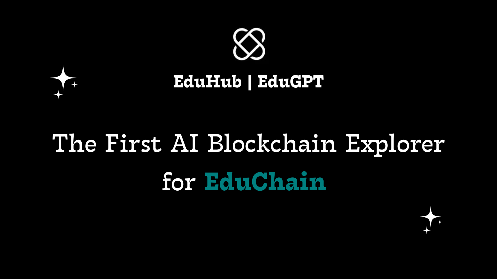
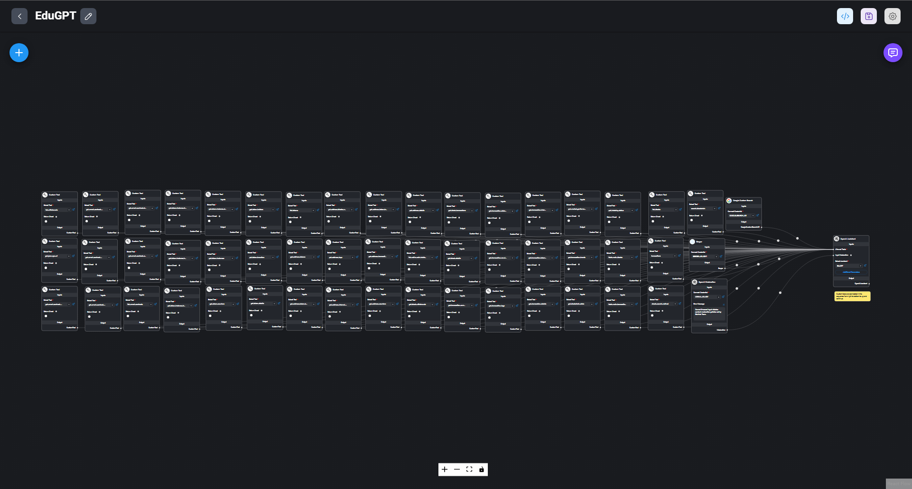

# > EduGPT 🤖

## Introduction

- EduGPT is the First AI-Powered Blockchain Explorer for EduChain ⚡
- EduGPT helps developers to build complex Web3 projects on EduChain ⚡

EduGPT is an smart AI Assistant built for the EduChain Community & Developers. It is designed to provide answers to questions about the EduChain ecosystem, including its on-chain data, projects, events, and community.

EduGPT is built with the OpenAI, LangChain, Flowise, Open Campus ID SDK, and so much more.

## Features

👉🏻 Connect with OCID to access the application.  
➡️ One time Name & Email require to access the Application.  
🎯 Personalized answers for community & developers.  
🔥 Query the real-time blockchain data using natural language.  
🕒 Real-time updates from Internet.  
👨‍💻 Chat via CUI (Conversational User Interface).  
🎤 Voice functionality for easy interaction.  
👍 Provide Feedback.  
☑️ 12 Limit Messages per 24 hours.  

## Benefits

🌟 Enhances community & developer experience.  
📰 Keeps the Web3 community informed.  
🌐 Makes Web3 more accessible.  
📈 Assist greater engagement and Web3 space development.  

## Tech Stack

- **Open Campus ID SDK**: To connect/login the users with the open campus ecosystem.
- **Blockscout for on-chain data**: Used 50+ API Endpoints to build the custom tools (Function Calling) to get different kinds of data from the explorer.
- **OpenAI Assistant APIs**: Powers the natural language processing abilities to deliver accurate responses and maintain a conversational style with (function calling, code interpreter, and file search).
- **FlowiseAI**: Customized LLM orchestration flow tool, powered by LangChain.
- **Next.js, TypeScript, TailwindCSS**: Provides a seamless, dynamic user interface with a consistent design.
- **OpenAI GPT-4o and Moderation APIs**: Handles advanced chatbot responses and content moderation.
- **Google Custom Search API**: Allows the chatbot to fetch relevant information online to provide up-to-date answers.
- **Custom Training Data with Prompt Engineering**: Ensures precise responses through well-crafted prompts and curated data.
- **OpenAI Whisper API for Speech-to-Text**: Supports speech recognition to deliver a multi-modal experience.
- **LangSmith API for Chatbot Analysis**: Analyzes chatbot interactions for optimization and refinement.

### **=> How Everything is Connected? (FlowChart)**

- [Flowise Github Repositry](https://github.com/flowiseai/flowise) (Backend deployed on Render and connected to the chatbot UI frontend on Vercel via APIs programmatically).
- [FlowiseChatEmbed Github Repositry](https://github.com/flowiseai/FlowiseChatEmbed) (UI/UX of the Chatbot, Connected via CDN).

➡️ **[Access Web Application Here](https://ai.eduhub.dev/)**  
➡️ **[Prompt used for Assistant Training](./prompt-engineering/prompt.md)**  

### **Summary of Custom Tools to extract on-chain Created So Far**

Read the [API_ENDPOINTS_OVERVIEW](./ai-explorer/api_endpoints_overview.md) file for more technical details about the API's.

Read the [USER_QUERIES](./ai-explorer/user_queries.md) file for more details about example user queries with the endpoint calling and mapping.

1. **Transaction-Related Tools:**
   - `get_transaction_state_changes`
   - `get_transaction_summary`
   - `get_transaction_details`
   - `get_transaction_token_transfers`
   - `get_transaction_internal_transactions`
   - `get_transaction_logs`
   - `get_transaction_raw_trace`

2. **Block-Related Tools:**
   - `get_block_details`
   - `get_block_transactions`
   - `get_block_withdrawals`

3. **Address-Related Tools:**
   - `list_native_coin_holders`
   - `get_address_details`
   - `get_address_counters`
   - `get_address_transactions`
   - `get_address_token_transfers`
   - `get_address_internal_transactions`
   - `get_address_logs`
   - `get_address_blocks_validated`
   - `get_address_token_balances`
   - `get_address_tokens`

4. **Token-Related Tools:**
   - `list_tokens`
   - `get_token_details`
   - `get_token_transfers`
   - `get_token_holders`
   - `get_token_counters`

5. **Smart Contract-Related Tools:**
   - `list_smart_contracts`
   - `get_smart_contract_counters`
   - `get_smart_contract_details`
   - `get_smart_contract_methods_read`
   - `get_smart_contract_methods_read_proxy`
   - `get_smart_contract_methods_write`
   - `get_smart_contract_methods_write_proxy`
   - `execute_smart_contract_query`
   - `get_json_rpc_url`

6. **Withdrawal-Related Tools:**
   - `list_withdrawals`

---

## Future Improvements

**Expanded Knowledge Base:** Improve the ***EduGPT*** by incorporating additional EduChain resources data to provide more comprehensive and technical answers into simple words. 

**Enhance Community Analytics:** Access real-time community sentiment about the EduChain projects through metrics from X and other social platforms for multiple use cases. 
